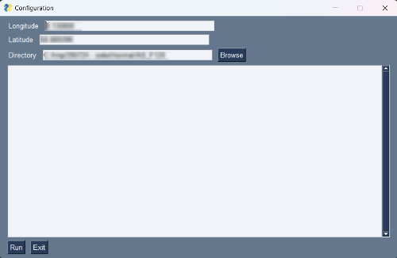
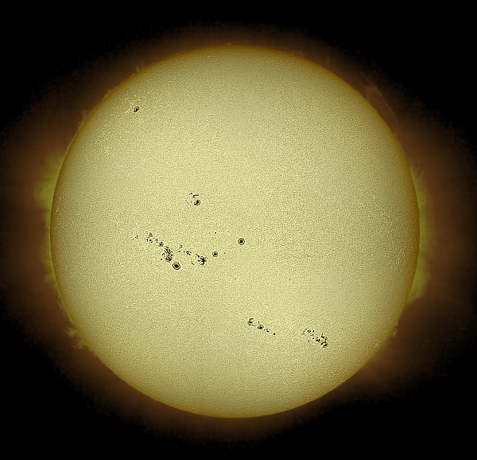

# SUN Image Derotator

When you image the sun, you take a lot of pictures to take the best and stack them. It could take some times.
When your telescope has a too large focale, the sun will not fit in one picture. So you take part and assemble them after.
But, the whole process takes time, and if you have an altaz mount, the SUN picture will slowly rotate, and it could be hard to assemble afterward.
This script make a rotation to compensate this apparent movment.

AND Yes, I broke the event loop as I did edit images in the main loop, but not a problem for this kind of GUI :)

The process for SUN Imaging :

- Take SER files with 2K-3K images,
- Assemble 100 images with Autostakkert,
- Use Astrosurface to apply wavelet transformation, save as bmp
- Use this script to rotate the pictures,
- Use imerge to make the mosaics
- Edit with gimp/photoshop/whatever you're used to use

Enjoy the result :

(protuberances are copied from helios website for composite image)
